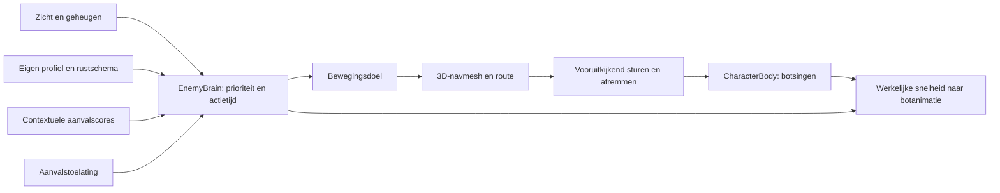

# Enemy-AI: gedrag, variatie en beweging

Onderzocht en geïmplementeerd op 12 september 2026. Voor dit actieprototype is de gekozen combinatie: expliciete actietoestanden, contextuele aanvalscores, een eigen gedragsprofiel per instance, automatische 3D-navigatie en een aparte besturing voor beweging. Dit sluit aan op de bestaande EnemyBrain, GameClock en aanvalstoelating. Het systeem kent geen kamernaam, vaste gridgrenzen of voorgeschreven brug-/trapcoördinaten. Er is geen universeel beste bewegingsalgoritme voor ieder spel.

## Wat het onderzoek oplevert

Het aangeleverde artikel bespreekt hoe vaste of willekeurige keuzes in turn-based games onvoldoende op spelers reageren. Het stelt onderzoek naar slimmere tegenstanders voor; het bewijst geen betere Godot-implementatie en geen automatisch grotere spelvreugde door machine learning. Onze vertaling is: zichtbare omstandigheden moeten de volgende actie verklaren. [Raven Fischer, AMT Lab](https://amt-lab.org/blog/2026/3/rs-turn-based-game-ai).

Utility theory biedt scores om acties onder de huidige omstandigheden te vergelijken. Hysterese en het afmaken van gekozen acties helpen voortdurend wisselen te voorkomen. Daarom kiest onze AI alleen bij het krijgen van een aanvalsbeurt een slag; kleine voorkeuren kunnen vergelijkbare opties onderscheiden. [David Graham, Game AI Pro, hoofdstuk 9](https://www.gameaipro.com/GameAIPro/GameAIPro_Chapter09_An_Introduction_to_Utility_Theory.pdf).

Reynolds onderscheidt actiekeuze, steering en locomotion. A* vindt een route; volgen, aankomen en nabije obstakels vermijden vragen aanvullende besturing. Afremmen bij een bestemming voorkomt heen-en-weer schieten over het doel. Dit is de basis voor onze gescheiden route- en bewegingscomponenten. [Craig Reynolds, Steering Behaviors for Autonomous Characters](https://www.red3d.com/cwr/steer/gdc99/).

Godots NavigationAgent kan paden volgen en RVO-vermijding leveren, maar avoidance heeft geen ingebouwde kennis van physicscolliders of de navmesh. Die laag vervangt dus geen botsingscontrole of gedragslogica. We gebruiken daarom Godots 3D NavigationMesh voor de route en een afzonderlijke besturing met voorspelde ontmoetingen en controles langs de loopruimte. [Godot: NavigationAgents](https://docs.godotengine.org/en/stable/tutorials/navigation/navigation_using_navigationagents.html).

ORCA verdeelt vermijdingsverantwoordelijkheid tussen agents en lost toegestane snelheden via lineaire optimalisatie op. Dat is een relevante kandidaat voor grotere mensenmassa's. De hier geïmplementeerde kandidaatbesturing is geen ORCA en claimt diens formele garanties niet. [Oorspronkelijke ORCA-publicatie en projectpagina](https://gamma-web.iacs.umd.edu/ORCA/).

## Gedrag dat nu in de game zit



Prioriteit: dood en bestaande hitreacties, vastgelegde gevechtsfasen, waarnemen/achtervolgen/terugkeren, vervolgens de rustroutine. Alle verlopen tijd komt uit GameClock. Pauze en hitstop bevriezen zowel gedrag als pose.

De wacht ademt, verplaatst zijn gewicht, kijkt soms rond en loopt korte routes rond zijn thuispositie. Waarneming onderbreekt de routine. De eerdere idle/return-overgang zette de rusttijd telkens opnieuw op nul; idle en patrol blijven nu geldige rusttoestanden.

Tijdens een gevecht kiest de wacht een korte slag dichtbij of een uitval om afstand te sluiten. Zichtbaar booggebruik geeft voorkeur aan de uitval met een schuine benadering. Een zichtbare zware laadpose kan na reactietijd een korte verplaatsing uitlokken; dat geeft de aanvalsbeurt vrij. De verplaatsing heeft een eindtijd en cooldown. Hij leest geen knoppen en geen actuele speleractie achter een boom. Zijn eenmaal ingezette zwaai blijft vastliggen, met alleen de reeds toegestane vroege bijrichting.

## Variatie die een eigen karakter behoudt

`EnemyVariation` bevat grenzen; elke EnemyBrain bezit een eigen RNG en gesamplede eigenschappen. De gedeelde Resource wordt niet aangepast. `variation_seed=0` leidt de seed af uit het instancepad; een expliciete seed maakt een spawn of replay reproduceerbaar. Nieuwe instances met unieke namen krijgen verschillende profielen. Een reset reproduceert dezelfde identiteit en hetzelfde beginschema.

| Eigenschap | Eikelwacht |
|---|---|
| Loopsnelheid | 90–110% van 2,25 m/s |
| Reactietijd | 75–140% van de ingestelde tijd |
| Pauze na aanval | Eigen factor 0,8–1,6, plus begrensde variatie per afgeronde beurt |
| Afstand bij omcirkelen | 88–115% van 1,55 m |
| Rustanimatie | Eigen fase en tempo 85–115%; soms rondkijken na een korte vertraging |
| Rustduur | 2,4–3,2 s × eigen factor 0,7–1,3 |
| Patrouille | Eigen routehoek, radiusfactor 0,8–1,12, verschillende volgende routepunten |
| Aanvalskeuze | Eigen kleine voorkeur per slag; beperkte extra variatie bij een nieuwe beslissing |

Er wordt niet iedere physicsstap een nieuwe willekeurige koers gekozen. Afstand, zicht en de speleractie blijven belangrijker dan kleine scorevariatie. Voorbereiding, contactmoment en schade van een gekozen aanval blijven vaste data. Zo verschillen vijanden in ritme en keuzes, terwijl een aangekondigde slag te leren is.

## Bewegingsalgoritme en grenzen

1. De autoload `NavigationWorld` verzamelt automatisch StaticBody3D-colliders op de WORLD-laag uit de actieve scene. Godot bakt daar op een achtergrondtaak een NavigationMesh van. Grond, bruggen, hellingen, obstakels en voldoende hoofdruimte volgen uit die geometry. De bron wordt naar wereldcoördinaten omgezet, dus verplaatste/gedraaide/geschaalde levelroots krijgen dezelfde behandeling. [Godot: NavigationMesh](https://docs.godotengine.org/en/stable/classes/class_navigationmesh.html).
2. Vijanden met dezelfde straal en hoogte delen navigatiekaarten. Naast de fysieke maat wordt een voorkeurskaart met 0,20 m extra straal gevraagd (eikel: afgerond 0,30 en 0,50 m). Die levert ruimere routes langs obstakels. Een onbereikbaar eindpunt of een niet-beloopbare aansluiting valt terug op de kaart voor de fysieke maat; een korte eindbenadering mag daarop aansluiten. De maten worden naar boven afgerond in stappen van 0,1 m. Een optionele opgeslagen navigatiecache wordt alleen gebruikt als de colliderhash overeenkomt en de afmetingen geschikt zijn. Na levelwijzigingen wordt een ongeldige cache automatisch vervangen door een nieuwe berekening. De AI wacht tot de regio daadwerkelijk in de opvraagbare kaart staat; alleen een afgeronde baktaak of een iteratieteller was onvoldoende.
3. `EnemySurfaceNavigation` vraagt een 3D-pad op bij NavigationServer3D. Onbereikbare doelen mogen hooguit een route naar de dichtst bereikbare plek opleveren; er is geen rechte lijn door een muur of over ontbrekende grond. Padpunten behouden hun hoogte; korte stuurprobes volgen het lokale oppervlak en mogen geen grote hoogtesprong afsnijden.
4. `EnemyLocomotion` cachet de route en volgt een punt 0,55 s vooruit langs het pad, begrensd tot 0,35–1,20 m. Verkorte padsegmenten worden tegen de gebruikte voorkeurskaart gecontroleerd, zodat het afsnijden de extra ruimte niet meteen opheft. Het vergelijkt negen koerskandidaten, met controles vlak vóór de voeten en verder vooruit. Een voorspelde te kleine afstand tot nabije vijanden verlaagt de score. Een vaste passeervolgorde en lichte richtingstrouw beperken trillen. Een onveilige kandidaat kan wachten. Gewone bochten vertragen op basis van de richtingsovereenkomst en blijven lopende bogen; een omkering begint op de plaats. Verplaatsing blijft langs de neus lopen. Een kleine afwijking van de navmesh wordt zonder teleport gecorrigeerd, met verschillende in-/uitschakeldrempels.
5. Buurtselectie gebruikt een ruimtelijk hashgrid van 3 m. Iedere tick worden agents eenmaal ingedeeld; de besturing leest alleen nabije cellen en vergelijkt maximaal acht buren. De route wordt opnieuw gevraagd na een interval, relevante doelverplaatsing of uitblijvende voortgang, niet standaard iedere physicsstap.
6. `move_and_slide()` blijft de fysieke botsingen en grondhellingen afhandelen. De presenter gebruikt `get_real_velocity()` na botsingsafhandeling voor de pasfrequentie. Godot onderscheidt werkelijk afgelegde snelheid van de aangevraagde velocity. [CharacterBody3D-documentatie](https://docs.godotengine.org/en/stable/classes/class_characterbody3d.html#class-characterbody3d-method-get-real-velocity).

De koers wordt bovendien met `PhysicsServer3D.body_test_motion()` tegen de echte actorcollider gecontroleerd. Recast kan een lage zijrand verbinden die voor een CharacterBody toch een te steile wand is; alleen navmeshprobes waren daar onvoldoende. Passieve doelen en andere botsende bodies vallen ook onder deze controle. Actieve buren blijven onder de bestaande voorspellende vermijding vallen, zodat hun huidige positie een voorspelde vertrekbeweging niet blokkeert. Twee zijdelingse probes geven een voorkeur voor 0,10 m extra afstand; die voorkeur blokkeert geen verder fysiek bruikbare kandidaat. [Godot: bewegingsprobes](https://docs.godotengine.org/en/stable/classes/class_physicstestmotionparameters3d.html).

Bij hoogteverschil boven 0,45 m blijft de eikel naderen in plaats van een aanval te beginnen; dezelfde grens bewaakt schade. Dit is een instelling per type. Een geblokkeerde aanloop die zijn aanvalstoelating verliest, behoudt zijn opgebouwde wachttijd. Zijn wachtbonus blijft groeien, zodat nieuwe aanvragen hem niet blijvend verdringen.

## Zelf grote levels bouwen

Plaats normale grond-/muur-/objectcolliders op de WORLD-laag (laag 1) en opgeslagen enemy-instances. Er is geen Arena-basisscript, lijst met waypoints, naam voor een trap, of handmatig begrensd AI-grid nodig. Alleen zichtbaar decor zonder collision kan niet automatisch een fysiek obstakel zijn. Voor trappen moet de collision fysiek beloopbaar zijn, zoals de bestaande rampcolliders; een navmesh geeft een CharacterBody geen magische klim- of springbeweging.

Bij de eerste behoefte bakt het systeem automatisch. Voor een snelle start kun je vóór spelen/export een cache opslaan met dezelfde algemene tool:

```sh
/Applications/Godot.app/Contents/MacOS/Godot --headless --path . --script tools/bake_enemy_navigation.gd -- res://scenes/levels/JouwLevel.tscn
```

Deze tool schrijft een `*_navigation.tres` en een uitgeschakelde cache-regio in de opgegeven scene; de gedeelde service gebruikt de data. De cache is optioneel. Toegevoegde of verwijderde statische colliders maken de runtimekaart automatisch ongeldig. Als een script een bestaande collider verplaatst of zijn shape wijzigt, roep na die batch `NavigationWorld.invalidate()` aan. Herberekenen wist verouderde paden en gebeurt opnieuw op de achtergrond.

Gecontroleerd: een apart 256 × 256 m grondlevel op (1000, 0, -500), zonder Arena-script of navigatiecache. Het maakt automatisch een route van 200 m om een muur; een los eiland blijft onbereikbaar. Het opnieuw berekenen na een gewijzigde muur verplaatst de toegankelijke doorgang. De huidige test bakte in 1,28 s op deze Mac; dit is een eenvoudige testwereld, geen benchmark voor een dichtgevulde open wereld.

Er zijn geen gehoorprikkels, leerproces, voet-IK, spronglinks of bewegende-platformlogica. Zicht gebruikt afstand en obstakelrays. De huidige automatische herberekening omvat de geladen scene als geheel: streaming met zeer veel wijzigingen vraagt later chunkgewijze bakes en profiling. Navigatiegegevens en buurtselectie zijn gedeeld; een werkelijk enorme, dichtbevolkte wereld moet nog met representatieve content worden gemeten.

## Een nieuw enemytype toevoegen

- Maak een opgeslagen NPC-scene met Damageable, Health, Brain en een visual. Een bestaand type kan via scene-overerving gespecialiseerd worden.
- Lever een eigen `EnemySettings` met `EnemyMovementSettings`, `EnemyVariation`, tactiekdata en `EnemyAttackDefinition`-varianten. Straal en hoogte moeten de fysieke capsule omvatten. Geef langzamere types passende snelheid, versnelling, draaivermogen en rustgrenzen.
- Stel per aanval bereik, hoek, uitval, voorbereiding, actieve duur, contactfractie, herstel en clipnamen in. Nieuwe gedragsregels horen in de bestaande beslislaag; een animatieclip veroorzaakt geen schade.
- Lever de passende bones, clips en sockets in de visual. Stel de natuurlijke loop-/rencyclussnelheid op de presenter af; die informatie hoort bij de animatie.
- Geef gespawnde instances unieke namen of expliciete seeds. Test het type eerst alleen, vervolgens samen met bestaande vijanden.

Sentinel/Bruiser behouden hun combatdata en gebruiken nu ook de algemene navigatie. Tactics en variation zijn optioneel; movement heeft een standaardprofiel en is gedeeld inzetbaar; een visuele modelnaam staat nergens in de beslis- of bewegingscode.

## Herhaalbare controles

```sh
/Applications/Godot.app/Contents/MacOS/Godot --path . res://tests/fixtures/EnemyCornerApproaches.tscn -- --fps=60
/Applications/Godot.app/Contents/MacOS/Godot --headless --path . --fixed-fps 120 res://tests/fixtures/EnemyCornerApproaches.tscn -- --fps=0
/Applications/Godot.app/Contents/MacOS/Godot --path . -- --acorn-replay --fps=60
/Applications/Godot.app/Contents/MacOS/Godot --path . -- --enemy-movement-replay --fps=60
/Applications/Godot.app/Contents/MacOS/Godot --path . -- --enemy-surface-replay --fps=60
/Applications/Godot.app/Contents/MacOS/Godot --headless --path . res://tests/fixtures/LargeNavigationWorld.tscn
python3 tools/run_checks.py --character red_panda --caps 60 --headless
```

`acorn_replay.gd` controleert echte melee/pijltreffers, leesbare aanvalstijden, ontwijken, waarneming, reactie op heavy/bow, terugdraaien, rust, patrouille, pauze, dood en respawn. `enemy_surface_replay.gd` test brug en beide trappen in beide richtingen en achtervolging vanaf hun zijkant. `navigation_world_replay.gd` test de afzonderlijke grote wereld. `enemy_movement_replay.gd` controleert onafhankelijke seeds en animatiefasen, obstakelruimte, aankomst, routecache, onbereikbare doelen en passerende vijanden. Rapporten en actuele rendereropnames staan onder `captures/acorn_guard/`; de gemeten resultaten staan in [ACORN_GUARD.md](ACORN_GUARD.md).

De hoekreplay reproduceerde vóór de correctie zes blokkades bij de lange trap. Hij test nu beide zijden van beide trapvoeten, passieve dummies, de rots en terugkeer over een verhoogde doorgang van 0,80 m. De ruimere voorkeurskaart kan die doorgang niet verbinden; de echte actor moet via de kleinere kaart de overkant bereiken zonder van de vloer te vallen. De opnamevariant toont een ruimere aanloop, de gemelde krappe startpositie en het passeren van een dummy. `shot()` bevriest uitsluitend de simulatie gedurende het wachten op een renderframe; een tijdelijk bedekt macOS-venster kan daardoor geen ongemeten gameplay laten verlopen. Deze visuele replays negeren gewone toetsen en echte controller-disconnects; hun eigen pauzecontroles blijven actief. De normale controllerregressie gebruikt ongewijzigde invoerafhandeling.
